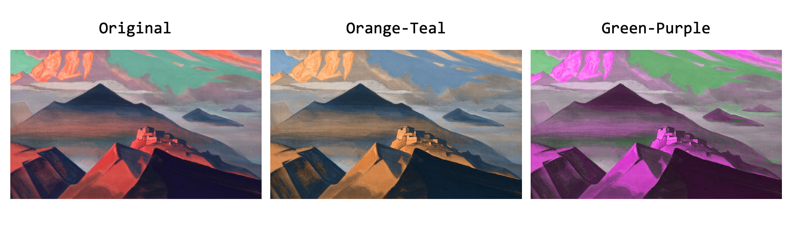

# Color Manipulation
This repository provides different tools to manipulate the color of an image. 

### `HSV_manipulations_demo.ipynb`
Changes hue, saturation and value by a fixed amount for each pixel. In the example: _Tent Mountain, 1933_ by Nicholas Roerich.

### `palettes_manipulations_demo.ipynb`
Assigns to an image the color palettes of another image. In the example: _Tent Mountain, 1933_ by Nicholas Roerich and _Untitled_ by Adnan Coker.

### `color_pixel_projection_demo.ipynb`
Maps the color pixel of one image to one chosen color axis, for example, orange-teal or green-purple. Intermediate changes are possible, too. In the example: _Tent Mountain, 1933_ by Nicholas Roerich.

## Contact
For questions: [ombretta.strafforello@kuleuven.be](mailto:ombretta.strafforello@kuleuven.be).

